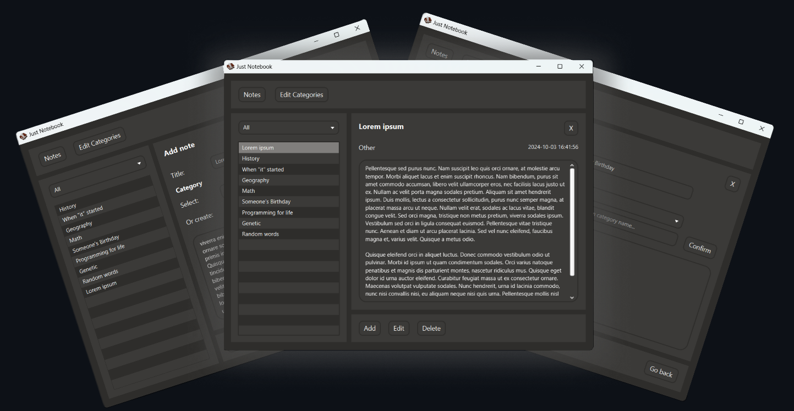

<h1 align="center" style="font-weight: bold;">Just Notebook 📓</h1> 

  <a href="#started">Getting Started</a> 
  <a href="#technologies">Technologies</a> 
  <a href="#code">Code</a> 
  <a href="#copyrights">Copyrights</a> 

 

Notebook app that focuses on simplicity and only essential functionality, to not distract your day-to-day use.
 
<h2 id="started">🚀 Getting started</h2>
<strong>1. Java 17+ Required</strong>  This app requires Java 17 or higher installed on your PC.

  <strong>2. Download the App</strong>  Navigate to the "FINISHED" folder. There you will find both the `.jar` and `.exe` files.    
<strong>3. Running the App</strong>  - With Java installed: Run either the `.jar` or the `.exe` file.
It will create a "notes.db" file that will serve as the database for your app, so keep it in the same location as your app.   
<strong>4. If you encounter any issues, feel free to contact me.</strong>   

<h2 id="technologies">💻 Technologies</h2>

- Java
- JavaFX
- CSS
- SQLite

<h2 id="code">🔟 Code</h2> This code works without lag and feels sufficient for a project of this type.    This project was almost scrapped two times (deleting around 80% of the code each time), before I settled on using plain JavaFX. The code may include some old, unused functions or other elements that shouldn't be present anymore.    I know that it's not the best, but I won’t be changing it in the near future, as I have too much on my plate with college, work, student committees, and other projects.    I apologize if the code feels unreadable or doesn’t hold the best structure, but from what I know, it works, doesn’t produce bugs, and isn’t slow.   

<h2 id="copyrights">©️ Copyrights</h2>
The icon used for the app is an item 'Book and Quill' from the game Minecraft.  
This app will never be put for any commercial usage, so until the policy change and won't allow the usage of this image I will probably leave it like this.